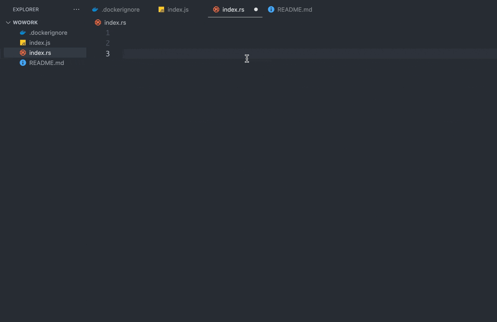

# Snip Cloud VScode

## Features

- Organization Management: Enable private sharing of your snippet base with your team
- Label Management: Add labels to your knowledge base for easy search and categorization
- API Management: Integrate your knowledge base with other systems, with each API having organization and tag-based permission controls

## Quick Start

### Prerequisites

You should create an account and get your API key from [Snip Cloud](https://www.snipcloud.io) first. if you don't have one, please register first. and read [quick start](https://docs.snipcloud.io/quickstart)

### Installation

1. install the extension from [VSCode Marketplace](https://marketplace.visualstudio.com/items?itemName=snip-cloud-vscode.snip-cloud-vscode).

2. open your VSCode, `Settings` -> `Extensions` -> `SnipCloud` -> `API Key` -> `Input your API Key`

3. enjoy it!
